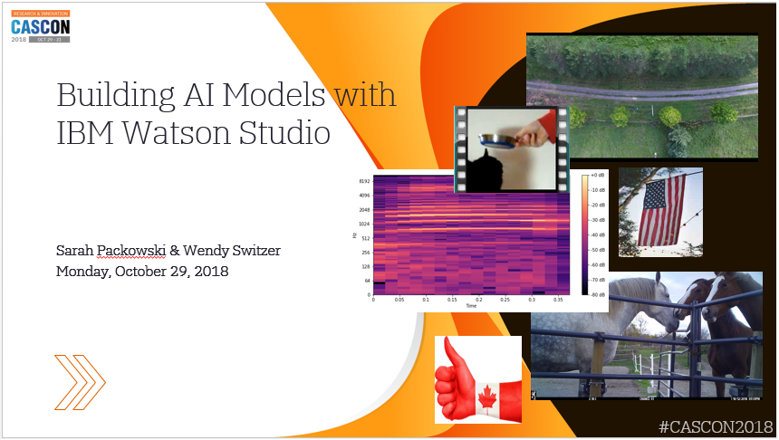

This repo contains material for a workshop at CASCON, on Monday, October 29, 2018:

[**Building AI models with IBM Watson Studio**](https://www-01.ibm.com/ibm/cas/cascon/workshop.jsp)
<p>&nbsp;</p>

# Presentation slides
In the workshop we'll be working through these slides:<br/>
https://github.com/spackows/CASCON-2018_Analyzing_images/blob/master/CASCON-2018_Building-AI_Models-w-Watson-Studio.pdf



<p>&nbsp;</p>

# Prerequisite instructions

*From noon - 1pm and from 2pm - 3pm on Monday afternoon, Wendy and Sarah will be available to help anyone who hasn't completed the prerequisite set up.  We'll be sitting near where the Expo is.. We'll be the ones sitting with the drone.*

You will be using your own laptop for this workshop.

**Complete the following steps using your laptop before Monday:**

1. Download data:
    1. Go to https://github.com/spackows/CASCON-2018_Analyzing_images
    2. Click Clone or download

    **Tip:** Download to somewhere with a short, easy path.  You will be navigating to this location several times.
 
2. Set up Watson Studio on IBM Cloud: https://dataplatform.cloud.ibm.com/registration/stepone

    **Tip:** This set-up link does three things: create an IBM id, register for IBM Cloud, and create an instance of Watson Studio in your IBM Cloud account.  If you have trouble with this set-up link, try breaking the steps down with these links:
    1. Create an IBM id and register for IBM Cloud: [https://console.bluemix.net/registration/](https://console.bluemix.net/registration/)
    2. Then log in to IBM Cloud and create an instance of Watson Studio from the IBM Cloud catalog: [https://console.bluemix.net/catalog/services/watson-studio](https://console.bluemix.net/catalog/services/watson-studio)
 
3. Create a project in Watson Studio:
    1. Got to https://dataplatform.cloud.ibm.com/ and Log In if you are not already logged in.
    2. Click New project, select Basic and click OK.
 
4. Add the downloaded data to your project:
    1. From the Assets tab, select New data asset
    2. Drop or browse for the downloaded files in the right hand panel. The files you need are:<br/><pre>
\<your drive\>:/CASCON-2018_Analyzing_images/cat-translator/training-data/\*.zip
\<your drive\>:/CASCON-2018_Analyzing_images/flags/training-data/\*.zip
\<your drive\>:/CASCON-2018_Analyzing_images/search-and-rescue/training-data/\*.zip
\<your drive\>:/CASCON-2018_Analyzing_images/water-consumption/training-data/\*.zip
</pre>

5.  [Optional]
    - If you want to run the sample Python apps on your local computer, [install Python](https://www.python.org/downloads/)
        - Make sure to have the installer add Python to your environments variables
        - Mac users, also install `pip` by issuing this command:
            ```
            sudo easy_install pip
            ```
        - Mac users, also add your user base binary directory to your path:
            1.  Find the user base binary directory by running this command:
                ```
                python -m site --user-base
                ```
            2.  Add your user base binary directory, with `/bin` appended, to the file `/etc/paths`
        
        See: [Complete instructions](https://www.architectryan.com/2012/10/02/add-to-the-path-on-mac-os-x-mountain-lion/)

    - If you want to push the sample Python apps to IBM Cloud as web apps, [install the IBM Cloud CLI](https://console.bluemix.net/docs/cli/reference/ibmcloud/download_cli.html#install_use)


Here is a video demonstrating steps 1-4:<br/>
https://youtu.be/rBD5MjqznNY

If you have any trouble performing these steps, feel free to email us:

Sarah Packowski<br/>
spackows@ca.ibm.com

Wendy Switzer<br/>
wswitzer@ca.ibm.com

<p>&nbsp;</p>

