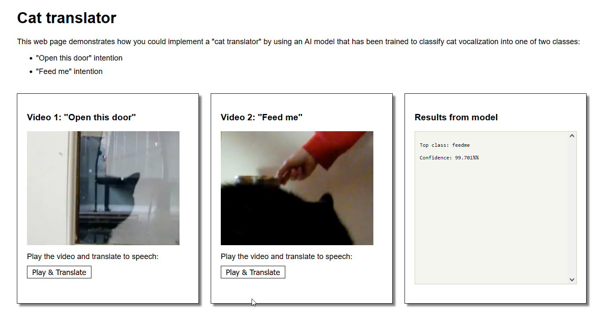

# How to train the cat-translator model
This Python notebook demonstrates using Tensorflow to build and train a model that classifies images, called spectrograms, of cat vocalization:

[Notebook: Classifying cat vocalization spectrograms](https://github.com/spackows/CASCON-2018_Analyzing_images/blob/master/cat-translator/sample-notebooks/cat-translator-classify-spectrograms.ipynb)

&nbsp;

# How to create spectrograms
This Python notebook demonstrates how to generate spectrograms from sample recordings of a cat meowing:

[Notebook: Creating spectrograms]()

&nbsp;

# Demo of cat-translator sample app
**Note:** If you intend to build the sample app and run it for yourself, vewing the demo ruins the surprise!  But if you do not intend to build the app yourself, and are just curious about what it's like.. enjoy:

[Demo: Cat translator sample app](https://youtu.be/6CEGDoT831A)

&nbsp;

          
          
