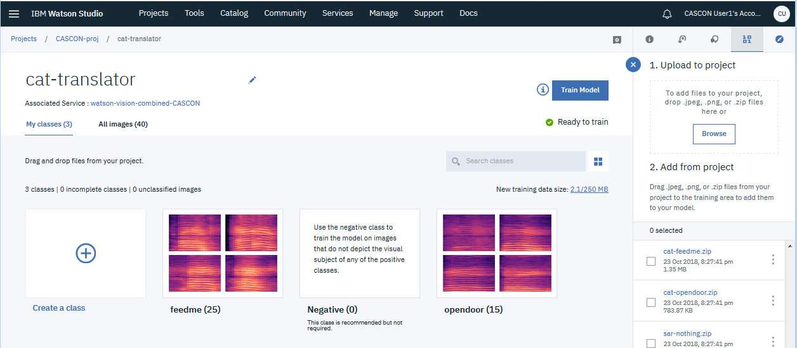

# How to train the cat-translator model

## Training files
- `cat-feedme.zip`
- `cat-opendoor.zip`

## Class names
The sample notebooks and apps expect the classes to be named the same as the training files, but without the `'cat-'` prefix and without the `.zip` extension:
- feedme
- opendoor

&nbsp;

# Demo of cat-translator sample app
**Note:** If you intend to build the sample app and run it for yourself, vewing the demo ruins the surprise!  But if you do not intend to build the app yourself, and are just curious about what it's like.. enjoy:

[https://cascon-2018-workshop-demo-cat-translator.mybluemix.net/](https://cascon-2018-workshop-demo-cat-translator.mybluemix.net/)

