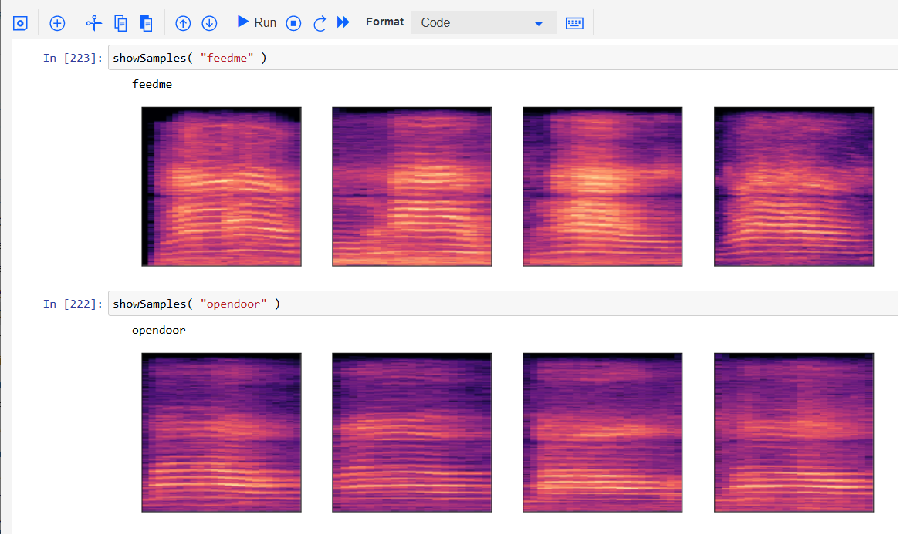
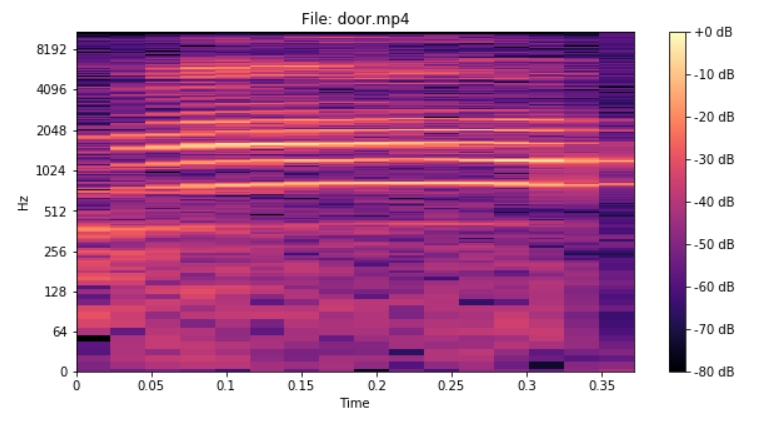
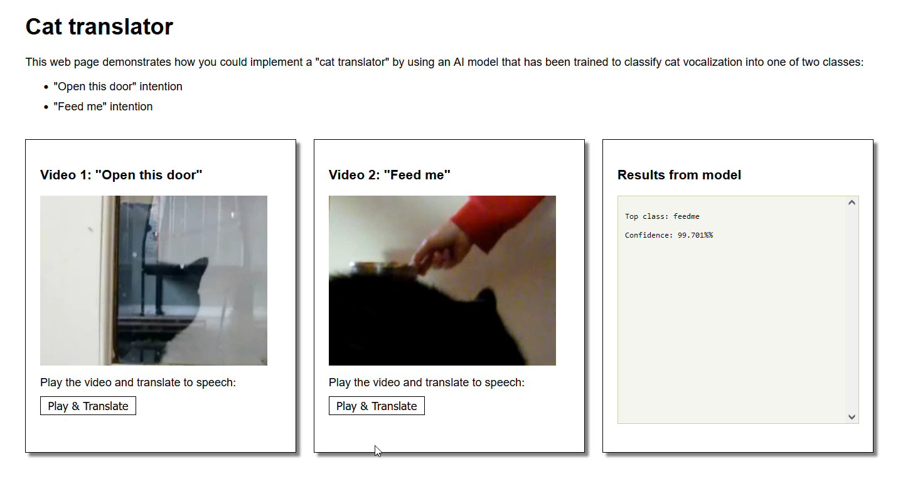

*April, 2022: The cat translator project was part of a [2018 CASCON workshop](https://github.com/spackows/CASCON-2018_Analyzing_images).  Since then, the Watson Visual Recognition tool that was used in the workshop has been discontinued.  So the model-training notebook and web app have been updated to use Tensorflow instead.*

&nbsp;

# How to train the cat-translator model
This Python notebook demonstrates using Tensorflow to build and train a model that classifies images, called spectrograms, of cat vocalization:

[Notebook: Classifying cat vocalization spectrograms](https://github.com/spackows/CASCON-2018_Analyzing_images/blob/master/cat-translator/sample-notebooks/cat-translator-classify-spectrograms.ipynb)

&nbsp;

# How to create spectrograms
This Python notebook demonstrates how to generate spectrograms from sample recordings of a cat meowing:

[Notebook: Creating spectrograms](https://github.com/spackows/CASCON-2018_Analyzing_images/blob/master/cat-translator/sample-notebooks/cat-translator-app-code-notebook.ipynb)

&nbsp;

# Sample cat-translator web app
The [cat-translator web app](https://github.com/spackows/CASCON-2018_Analyzing_images/tree/master/cat-translator/sample-app) puts the image classification model to work.  Watch this demo of the app in action:

[Demo: Cat translator sample app](https://youtu.be/tZUp4MvJpdI)

&nbsp;

          
          
