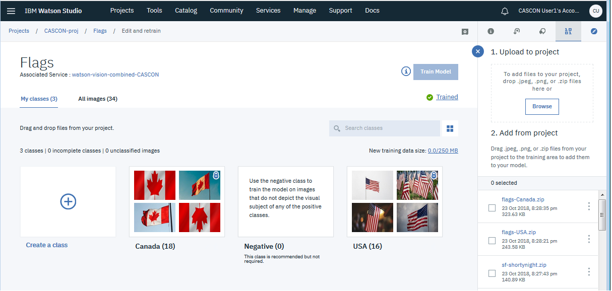

# How to train the flags model

## Training files
- `flags-Canada.zip`
- `flags-USA.zip`

## Class names
The sample notebooks and apps expect the classes to be named the same as the training files, but without the `'flags-'` prefix and without the `.zip` extension:
- Canada
- USA

&nbsp;

# Demo of flags sample app
**Note:** If you intend to build the sample app and run it for yourself, vewing the demo ruins the surprise!  But if you do not intend to build the app yourself, and are just curious about what it's like.. enjoy:

[https://cascon-2018-workshop-demo-flags.mybluemix.net/](https://cascon-2018-workshop-demo-flags.mybluemix.net/)

&nbsp;

# Image credits and citations

#### Images from Unsplash (https://unsplash.com/license)
- Photo by Joshua Hoehne (https://unsplash.com/photos/pSSYVe4rcs0)
- Photo by Joshua Hoehne (https://unsplash.com/photos/7s1j-DZ5KYQ)
- Photo by DAVIDCOHEN (https://unsplash.com/photos/7lmq5Gniypg)
- Photo by Jordhan Madec (https://unsplash.com/photos/0RMgorRDQQY)
- Photo by Anthony DELANOIX (https://unsplash.com/photos/nxpw92fiGw8)
- Photo by Jp Valery (https://unsplash.com/photos/-ph1Fqhx5Ko)
- Photo by Matt Botsford (https://unsplash.com/photos/Jf4lKpDgklI)
- Photo by Alex Martinez (https://unsplash.com/photos/G0SLCrt5OCY)
- Photo by Marco Krenn (https://unsplash.com/photos/iVtNNdvhldA)
- Photo by Jordan Crawford (https://unsplash.com/photos/aE94tJ61F1E)
- Photo by Raúl Nájera (https://unsplash.com/photos/TAqspfWom04)
- Photo by Adam Birkett (https://unsplash.com/photos/Zf4NoRKEhtE)
- Photo by Kevin Morris (https://unsplash.com/photos/yB5PHCOgPeo)
- Photo by Cal Engel (https://unsplash.com/photos/4IzblBCtVyk)
- Photo by Valentino Funghi (https://unsplash.com/photos/fUWCe_pPPY0)
- Photo by Jacob Morrison (https://unsplash.com/photos/-RO2DFPl7wE)
- Photo by Cris DiNoto (https://unsplash.com/photos/OiQUrC4pgZc)
- Photo by Jonathan Denney (https://unsplash.com/photos/Ds0xACooELY)
- Photo by Pam Menegakis (https://unsplash.com/photos/Qp4VpgQ7-KM)
- Photo by Hermes Rivera (https://unsplash.com/photos/ahHn48-zKWo)

#### Images licences under CC0 Public Domain
- https://www.publicdomainpictures.net/en/view-image.php?image=86181&picture=heart-flag-canada
- https://www.publicdomainpictures.net/en/view-image.php?image=56959&picture=canadian-flag
- https://www.publicdomainpictures.net/en/view-image.php?image=87954&picture=torn-american-flag
- https://pixabay.com/en/canadian-flag-canada-maple-country-1229484/
- https://pixabay.com/en/flag-canadian-country-nation-220052/
- https://pixabay.com/en/canada-north-america-national-flag-1157521/
- https://pixabay.com/en/canada-hand-flag-country-pride-649858/
- https://pixabay.com/en/canada-flag-hdr-2262774/
- https://pixabay.com/en/flag-canada-red-white-canadian-472394/
- https://pixabay.com/en/international-flag-liberia-2694616/

#### Images from Country Flags (https://www.countryflags.com/en/), part of roll-up (https://www.roll-up.com/en/)
- canada-flag-medium.jpg (https://www.countryflags.com/en/canada-flag-image.html)
- canada-flag-wave-medium.jpg (https://www.countryflags.com/en/canada-flag-image.html)
- canada-flag-waving-medium.jpg (https://www.countryflags.com/en/canada-flag-image.html)
- canada-flag-heart-3d-medium.jpg (https://www.countryflags.com/en/canada-flag-image.html)

