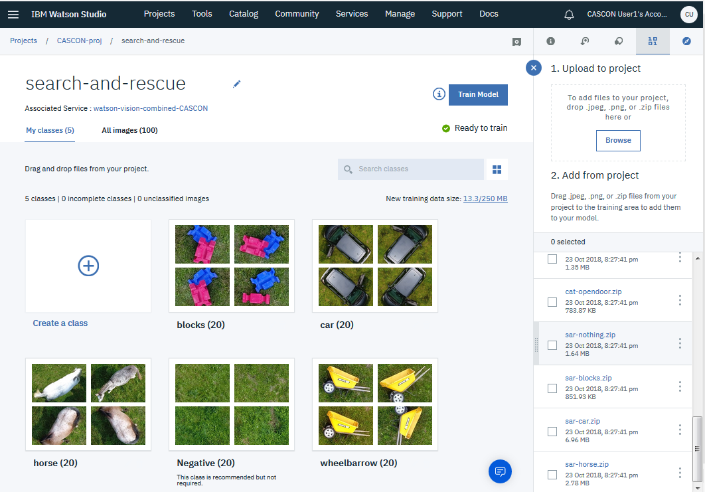

# How to train the search-and-rescue model

## Training files
- `sar-blocks.zip`
- `sar-car.zip`
- `sar-horse.zip`
- `sar-wheelbarrow.zip`
- `sar-nothing.zip`**

## Class names
The sample notebooks and apps expect the classes to be named the same as the training files, but without the `'sar-'` prefix and without the `.zip` extension:
- blocks
- car
- horse
- wheelbarrow

**Drag `sar-nothing.zip` onto the Negative class

