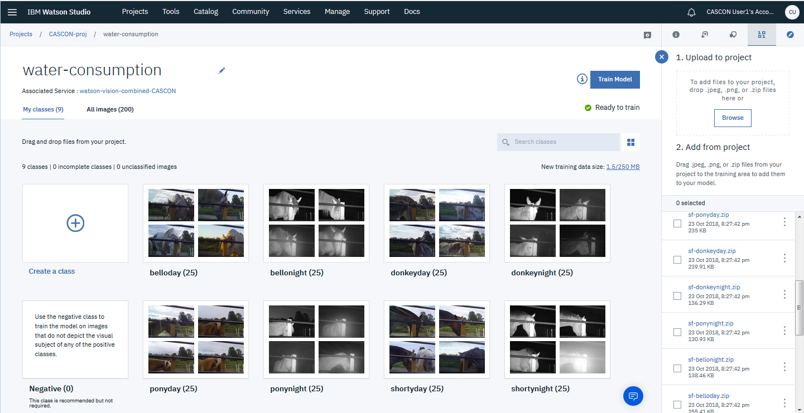

# How to train the water-consumption model

## Training files
- `sf-belloday.zip`
- `sf-bellonight.zip`
- `sf-donkeyday.zip`
- `sf-donkeynight.zip`
- `sf-ponyday.zip`
- `sf-ponynight.zip`
- `sf-shortyday.zip`
- `sf-shortynight.zip`

## Class names
The sample notebooks and apps expect the classes to be named the same as the training files, but without the `'flags-'` prefix and without the `.zip` extension:
- belloday
- bellonight
- donkeyday
- donkeynight
- ponyday
- ponynight
- shortyday
- shortynight

